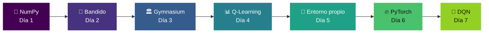
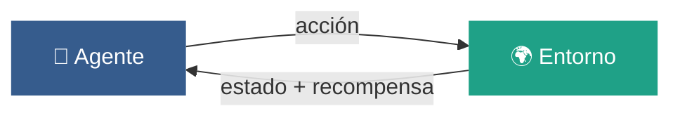

<div align="center">

# 🧊 rl-lab · 7 días de aprendizaje por refuerzo

**De cero a un agente que aprende solo — 1 hora por día, 7 días.**

Python para IA · Reinforcement Learning · Simulaciones

<br>


</div>

---

## 🎯 Qué es esto

Un plan de **7 horas repartidas en 7 días** para entender aprendizaje por refuerzo desde la práctica.
Sin teoría de arranque, sin cursos de 40 horas: **cada día termina con algo que se mueve en pantalla.**

El recorrido va de una grilla de NumPy a un agente DQN entrenado, pasando por escribir Q-Learning a mano y por diseñar tu propio entorno.



---

## 📅 El plan

| Día | Tema | El gancho | Al final tenés |
|:---:|:-----|:----------|:---------------|
| **1** | NumPy y tu primer mundo 5×5 | Dibujás el mundo donde va a vivir el agente | Una grilla con paredes, agente y meta |
| **2** | Bandido de 10 brazos | Ves con los ojos que el agente codicioso pierde | Gráfico de 4 curvas comparando ε |
| **3** | Gymnasium | Video del agente random haciendo desastres | Un `.mp4` y el loop de RL en la cabeza |
| **4** | Q-Learning tabular | De 2% a 90% de victorias en 10 segundos | Agente que resuelve FrozenLake + mapa de política |
| **5** | Tu propio laberinto | Rompés la recompensa y mirás al agente hacer trampa | `laberinto.py` propio, resuelto |
| **6** | PyTorch en una hora | La red es una tabla Q que sabe interpolar | Red entrenada + curva de loss |
| **7** | DQN de verdad | El video del "después", al lado del del martes | Agente que se banca CartPole entero |

---

## ⚙️ Setup

Todo con [`uv`](https://docs.astral.sh/uv/): un solo binario, se baja el Python que necesita y deja las dependencias dentro de la carpeta del proyecto. No ensucia el sistema — si querés borrar todo, borrás la carpeta.

<details open>
<summary><b>Windows · PowerShell</b></summary>

```powershell
powershell -ExecutionPolicy ByPass -c "irm https://astral.sh/uv/install.ps1 | iex"

uv init rl-lab
cd rl-lab
uv python pin 3.12          # stable-baselines3 pide 3.10+
uv add numpy matplotlib jupyterlab
uv run jupyter lab
```
</details>

<details>
<summary><b>macOS / Linux</b></summary>

```bash
curl -LsSf https://astral.sh/uv/install.sh | sh

uv init rl-lab && cd rl-lab
uv python pin 3.12
uv add numpy matplotlib jupyterlab
uv run jupyter lab
```
</details>

<details>
<summary><b>Sin instalar nada · Google Colab</b></summary>

[colab.research.google.com](https://colab.research.google.com) ya trae `numpy`, `matplotlib`, `torch` y `gymnasium`.
Sirve para los 7 días; la contra es que los videos y archivos viven en la nube.
</details>

> [!TIP]
> El **día 3**, antes de cerrar la notebook, dejá corriendo `uv add torch`. Es una descarga grande y el día 6 no querés gastar 15 de tus 60 minutos esperándola.

---

## 📏 Reglas del juego

- ⏱️ **60 minutos y cortás**, aunque quede a medias. Lo que quedó colgado es el arranque de mañana.
- 📓 **Un notebook por día**, todo en la misma carpeta. Al día 7 tenés un repo con 7 cosas que funcionan.
- 🧯 **Si algo no instala en 10 minutos**, pasate a Colab por ese día y seguí. El objetivo es RL, no pelearte con el entorno.
- 🔧 **Copiá el código, pero cambiale algo.** Un número, una recompensa, un tamaño de grilla. Ahí es donde aprendés de verdad.
- 🚫 **Nada de matemática por adelantado.** Cada día trae la fórmula que necesita ese día y ninguna más.

---

## 🗓️ Los 7 días en detalle

<details>
<summary><h3>🟣 Día 1 — NumPy y tu primer mundo de 5×5</h3></summary>

> Sabés programar, así que no vas a hacer "hola mundo". En la misma hora que tardás en instalar todo, **dibujás el mundo donde va a vivir tu agente**.

| Bloque | Qué hacés |
|:---|:---|
| `0–10` | Setup. Notebook nuevo: `dia1.ipynb`. |
| `10–35` | Python al toque viniendo de otro lenguaje: listas y dicts, *list comprehensions*, f-strings, y el desempaquetado `a, b = par` — lo vas a ver en cada `step()` de acá al final. |
| `35–50` | NumPy: array vs lista, `shape`, indexado `grid[fila, col]`, `np.zeros`, `np.random`, `argmax`. **`argmax` es literalmente "qué acción conviene"**: lo usás los 6 días que siguen. |
| `50–60` | Matplotlib: `plt.imshow(grid)` y ver la grilla pintada. Movés el agente una celda y volvés a dibujar. |

```python
import numpy as np, matplotlib.pyplot as plt

grid = np.zeros((5, 5))     # 0 = piso
grid[2, 1:4] = -1           # pared
grid[4, 4]   =  1           # meta
agente = [0, 0]

grid[tuple(agente)] = 0.5
plt.imshow(grid, cmap="viridis"); plt.show()
```

**🧮 Mate del día** — Un **vector** es una fila de números; una **matriz** es una grilla de números. Eso es todo el álgebra lineal que hace falta hoy: tu mundo ya es una matriz.

**➕ Si te sobra tiempo** — Que el agente se mueva 20 pasos al azar y guardá cada frame en una lista.

</details>

<details>
<summary><h3>🟣 Día 2 — El bandido de 10 brazos: explorar vs. explotar</h3></summary>

> Diez tragamonedas, cada una con un promedio distinto que no conocés. Mil tiradas. **El agente codicioso pierde y lo vas a ver en el gráfico** — este es el momento en que el RL deja de ser abstracto.

| Bloque | Qué hacés |
|:---|:---|
| `0–10` | El concepto: recompensa, valor estimado `Q`, y por qué "elegir siempre lo mejor conocido" es una trampa. |
| `10–35` | Escribís el bandido: 10 brazos, política ε-greedy, media incremental. Son 10 líneas y ya es un agente que aprende. |
| `35–55` | Corrés 4 agentes con ε = 0, 0.01, 0.1 y 1, promediás 200 corridas y graficás las 4 curvas juntas. Ese gráfico es el "hola mundo" del RL. |
| `55–60` | Anotá qué ε ganó y por qué. Con 100 tiradas cambia el resultado: probalo. |

```python
q_real = np.random.normal(0, 1, 10)   # valor real, oculto
Q = np.zeros(10); N = np.zeros(10)

for paso in range(1000):
    if np.random.rand() < eps:
        a = np.random.randint(10)     # explorar
    else:
        a = int(np.argmax(Q))         # explotar
    r = np.random.normal(q_real[a], 1)
    N[a] += 1
    Q[a] += (r - Q[a]) / N[a]         # media incremental
```

**🧮 Mate del día** — `Q ← Q + α·(R − Q)`. Traducido: *movete un poquito hacia la sorpresa*. Ese `(R − Q)` es el **error de predicción** y es el motor de todo lo que viene, incluido DQN.

**➕ Si te sobra tiempo** — Probá ε decreciente (empieza en 1, baja a 0.01) y agregalo al gráfico. Spoiler: le gana a todos.

</details>

<details>
<summary><h3>🔵 Día 3 — Gymnasium: el contrato entre agente y entorno</h3></summary>

> Gymnasium (el sucesor mantenido de OpenAI Gym) es el estándar de facto: `reset()` y `step()`, nada más. **Terminás la hora con un video del agente random haciendo desastres** — ese video es el "antes" de la foto del día 7.



| Bloque | Qué hacés |
|:---|:---|
| `0–15` | Instalás y corrés el loop. Los 5 valores de `step()`: `terminated` (llegó o se murió) y `truncated` (se acabó el tiempo) son cosas distintas — confundirlos es el bug clásico. |
| `15–35` | `action_space` y `observation_space`: discreto vs. continuo. Compará CartPole (4 números continuos) con FrozenLake (16 estados enteros). Esa diferencia es la razón de ser del día 6. |
| `35–55` | Grabás video con el wrapper `RecordVideo` y mirás 3 episodios de un agente que juega al azar. |
| `55–60` | Dejá corriendo `uv add torch` antes de cerrar. |

```bash
uv add "gymnasium[classic-control,toy-text]" imageio imageio-ffmpeg
```

```python
import gymnasium as gym

env = gym.make("CartPole-v1", render_mode="rgb_array")
env = gym.wrappers.RecordVideo(env, "videos/random")

obs, info = env.reset(seed=0)
done = False
while not done:
    accion = env.action_space.sample()          # puro azar
    obs, recompensa, terminated, truncated, info = env.step(accion)
    done = terminated or truncated
env.close()
```

**🧮 Mate del día** — Ninguna. Hoy es vocabulario: **agente, entorno, estado, acción, recompensa, episodio**. Escribilos con tus palabras al final del notebook.

**➕ Si te sobra tiempo** — Corré 500 episodios random en FrozenLake y contá cuántos ganan. Ese número es tu línea de base para mañana.

</details>

<details>
<summary><h3>🔵 Día 4 — Q-Learning: la tabla que aprende sola</h3></summary>

> Una matriz de estados × acciones, un `for`, una línea de actualización. **En 10 segundos de entrenamiento pasás de 2% de victorias a más del 90%**, y después pintás la política como mapa de flechas.

| Bloque | Qué hacés |
|:---|:---|
| `0–10` | La tabla Q: 16 filas (estados) × 4 columnas (acciones). Cada celda es "qué tan bueno es hacer esto acá". |
| `10–35` | El loop de entrenamiento: ε-greedy (día 2) + la actualización de Bellman. 10.000 episodios, ε que baja, `gamma=0.95`. |
| `35–50` | Graficá la tasa de éxito cada 500 episodios y mirá la curva despegar. Después `Q.max(axis=1)` como heatmap y `Q.argmax(axis=1)` como flechas sobre el mapa. |
| `50–60` | Prendé `is_slippery=True` y mirá cómo se rompe todo. El azar en el entorno necesita más episodios y un `alpha` más chico. |

```python
Q = np.zeros((env.observation_space.n, env.action_space.n))
alpha, gamma = 0.1, 0.95

for ep in range(10_000):
    s, _ = env.reset()
    done = False
    while not done:
        a = env.action_space.sample() if np.random.rand() < eps else int(np.argmax(Q[s]))
        s2, r, term, trunc, _ = env.step(a)

        Q[s, a] += alpha * (r + gamma * Q[s2].max() - Q[s, a])   # ⭐ Bellman

        s, done = s2, term or trunc
    eps = max(0.01, eps * 0.999)
```

**🧮 Mate del día** — Esa línea es la **ecuación de Bellman**: el bandido de ayer más un agregado, la recompensa de ahora *más* lo mejor que puedo esperar del próximo estado, descontado por `gamma`. `gamma` es cuánto le importa el futuro: `0` = vive el momento, `0.99` = planifica largo.

**➕ Si te sobra tiempo** — Corré el mismo código en `Taxi-v3` sin cambiar nada. Que funcione tal cual es exactamente el punto de la API de Gymnasium.

</details>

<details>
<summary><h3>🟢 Día 5 — Tu propio laberinto (y hacer trampa a propósito)</h3></summary>

> Convertís la grilla del día 1 en un entorno de Gymnasium hecho por vos y le tirás encima el Q-Learning de ayer *sin tocarle una línea*. Después **rompés la recompensa a propósito y mirás al agente encontrar el agujero**: reward hacking en vivo.

| Bloque | Qué hacés |
|:---|:---|
| `0–25` | Subclase de `gym.Env`: `__init__` con los spaces, `reset()` que devuelve `(obs, info)` y `step()` que devuelve los 5 valores. Nada más. |
| `25–40` | Importás el agente del día 4 y lo entrenás en tu laberinto. Verlo resolver *tu* mapa pega distinto. |
| `40–60` | Diseño de recompensas: `-0.01` por paso, `+1` en la meta, `-1` en el pozo. Después ponéle `+0.1` cada vez que se acerca y mirá cómo aprende a oscilar para farmear puntos sin llegar nunca. |

```python
class Laberinto(gym.Env):
    def __init__(self, mapa):
        self.mapa = mapa
        self.action_space      = gym.spaces.Discrete(4)          # ↑ → ↓ ←
        self.observation_space = gym.spaces.Discrete(mapa.size)

    def reset(self, seed=None, options=None):
        super().reset(seed=seed)
        self.pos = (0, 0)
        return self._obs(), {}

    def step(self, accion):
        self.pos = self._mover(self.pos, accion)
        gano = self.pos == self.meta
        recompensa = 1.0 if gano else -0.01
        return self._obs(), recompensa, gano, False, {}
```

> [!WARNING]
> Si `reset()` no devuelve `(obs, info)` y `step()` no devuelve los **5** valores, cualquier librería de RL que le enchufes va a fallar con errores confusos. Es el error #1 al escribir entornos propios.

**🧮 Mate del día** — Probabilidad, versión práctica: si tu `step()` resbala 1 de cada 5 veces, la recompensa deja de ser un número y pasa a ser un **promedio esperado**. Por eso el agente necesita repetir tanto: está estimando una media, igual que en el día 2.

**➕ Si te sobra tiempo** — Agregá una llave que hay que juntar antes de la meta. Ojo: el estado ya no es solo la posición, tiene que incluir "¿tengo la llave?".

</details>

<details>
<summary><h3>🟢 Día 6 — PyTorch en una hora: por qué la tabla no alcanza</h3></summary>

> CartPole tiene estados continuos: la tabla tendría infinitas filas. La red neuronal es simplemente **una tabla Q que sabe interpolar**.

| Bloque | Qué hacés |
|:---|:---|
| `0–10` | Tensor = array de NumPy con dos superpoderes: corre en GPU y se acuerda de cómo lo calculaste (`requires_grad`). |
| `10–30` | El ciclo de entrenamiento, que es siempre el mismo: predecir → loss → `backward()` → `step()` → `zero_grad()`. Memorizá ese orden y sabés entrenar cualquier cosa. |
| `30–50` | Red de 2 capas que aprende a aproximar una función tuya (probá `sin(x)`). Graficá la predicción sobre los datos reales cada 100 épocas: es hipnótico. |
| `50–60` | Cambiá el `lr` a `1.0` y mirá explotar todo. Bajalo a `1e-6` y mirá cómo no aprende nada. Eso te ahorra semanas de debugging futuro. |

```python
import torch, torch.nn as nn

red = nn.Sequential(nn.Linear(1, 64), nn.ReLU(), nn.Linear(64, 1))
opt = torch.optim.Adam(red.parameters(), lr=1e-3)

for epoca in range(2000):
    pred = red(x)
    loss = ((pred - y) ** 2).mean()
    opt.zero_grad(); loss.backward(); opt.step()
```

**🧮 Mate del día** — La **derivada** es la pendiente: "si muevo este peso un poquito, ¿el error sube o baja?". `backward()` calcula esa pendiente para todos los pesos de una y `step()` los mueve un pasito en la dirección que baja. Eso es *todo* el descenso por gradiente.

**➕ Si te sobra tiempo** — Reemplazá la tabla Q del día 4 por una red que reciba el estado y devuelva 4 números. Ya estás escribiendo DQN a mano.

</details>

<details>
<summary><h3>🟡 Día 7 — DQN de verdad y el video del "después"</h3></summary>

> Con Stable-Baselines3 entrenás un DQN en CartPole en 5 minutos y grabás el video del agente que ya no se cae. **Al lado del video del día 3, ese es tu diploma.**

| Bloque | Qué hacés |
|:---|:---|
| `0–20` | `uv add stable-baselines3`, entrenar DQN en CartPole, evaluar y grabar. Tres líneas de librería, pero cada pieza de adentro ya la escribiste a mano. |
| `20–35` | Cambiá `DQN` por `PPO` — misma API. PPO es lo que se usa hoy para casi todo (robótica, juegos, y también para alinear modelos de lenguaje). Compará cuál converge más rápido. |
| `35–50` | Abrí `dqn.py` de CleanRL: implementación completa en un solo archivo, pensada para leerse. Reconocé las 3 piezas nuevas: **replay buffer**, **target network** y el ε-decay que ya conocés. |
| `50–60` | Escribí con tus palabras qué hace un agente de RL. Si podés explicarlo sin fórmulas, cerraste la semana. |

```python
from stable_baselines3 import DQN

modelo = DQN("MlpPolicy", "CartPole-v1", verbose=1)
modelo.learn(total_timesteps=60_000)
modelo.save("cartpole_dqn")
```

**🧮 Mate del día** — Ninguna nueva. DQN es el día 4 (Bellman) con el día 6 (una red en lugar de la tabla), más dos parches para que no se vuelva loco.

</details>

---

## ✅ Progreso

- [ ] **Día 1** — Grilla dibujada con NumPy + Matplotlib
- [ ] **Día 2** — Bandido de 10 brazos, gráfico comparando ε
- [ ] **Día 3** — Loop de Gymnasium + video del agente random
- [ ] **Día 4** — Q-Learning resolviendo FrozenLake + mapa de política
- [ ] **Día 5** — Entorno propio (`laberinto.py`) resuelto por el agente
- [ ] **Día 6** — Red en PyTorch entrenada + curva de loss
- [ ] **Día 7** — DQN entrenado + video del "después"

---

## 📁 Estructura del repo

```
rl-lab/
├── notebooks/
│   ├── dia1_numpy_grid.ipynb
│   ├── dia2_bandido.ipynb
│   ├── dia3_gymnasium.ipynb
│   ├── dia4_qlearning.ipynb
│   ├── dia5_laberinto.ipynb
│   ├── dia6_pytorch.ipynb
│   └── dia7_dqn.ipynb
├── envs/
│   └── laberinto.py          # entorno propio (día 5)
├── videos/
│   ├── random/               # el "antes"  (día 3)
│   └── dqn/                  # el "después" (día 7)
├── pyproject.toml
├── uv.lock
└── README.md
```

---

## 🚀 Después del día 7

<table>
<tr>
<td width="50%" valign="top">

**Si te enganchó simular**

- Escribí un **Snake** como `gym.Env` y entrenalo con PPO. El estado es la parte difícil y divertida.
- **PettingZoo** para multi-agente: dos agentes que compiten o cooperan.
- **Unity ML-Agents** si querés 3D y física de verdad.

</td>
<td width="50%" valign="top">

**Si te enganchó entender**

- **Sutton & Barto**, *Reinforcement Learning: An Introduction* — gratis y online, es la biblia. Leelo recién ahora que tenés el código en la mano.
- **Spinning Up** de OpenAI para policy gradients.
- Reimplementá PPO desde cero mirando CleanRL.

</td>
</tr>
</table>

---

## 🔗 Links

| Recurso | Para qué |
|:---|:---|
| [Gymnasium](https://gymnasium.farama.org/) | La API de entornos, con tutoriales oficiales |
| [Stable-Baselines3](https://stable-baselines3.readthedocs.io/) | Algoritmos listos para usar (DQN, PPO, SAC) |
| [CleanRL](https://github.com/vwxyzjn/cleanrl) | Implementaciones de un solo archivo, hechas para leer |
| [Spinning Up](https://spinningup.openai.com/) | Teoría de RL explicada por OpenAI |
| [uv](https://docs.astral.sh/uv/) | El gestor de paquetes de Python |

<div align="center">
<br>
<sub>7 días · 1 hora por día · el objetivo no es dominar RL, es volver a tener ganas de descubrir algo</sub>
</div>
